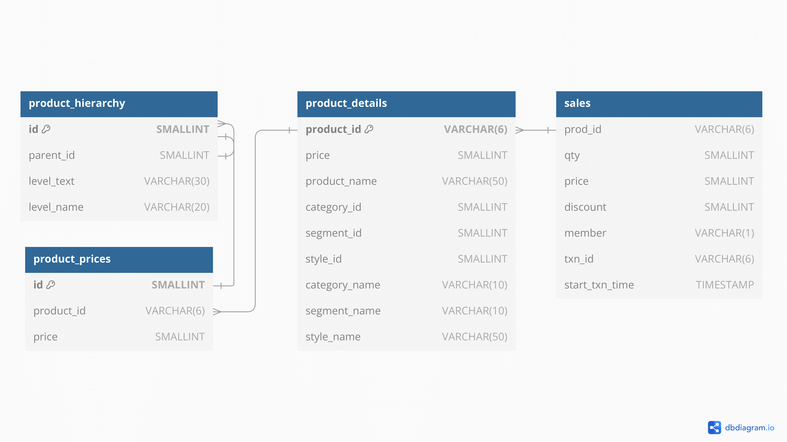

## Danny's Diner

### ERD

<figure markdown="span">
  { width="100%" }
  <figcaption>Danny's Diner</figcaption>
</figure>

### DDL

#### Members

```sql
CREATE EXTERNAL TABLE IF NOT EXISTS dannys_diner.members (
  customer_id CHAR(1) COMMENT 'Unique identifier for the customer, represented as a single character',
  join_date TIMESTAMP COMMENT 'Date and time when the customer joined the loyalty program'
)
COMMENT 'The members table captures the dates when each customer joined the beta version of the Dannys Diner loyalty program'
STORED AS PARQUET
LOCATION 's3://sql-case-studies/dannys_diner/members/'
TBLPROPERTIES ('classification'='parquet', 'parquet.compress'='SNAPPY');
```

#### Menu

```sql
CREATE EXTERNAL TABLE IF NOT EXISTS dannys_diner.menu (
  product_id INT COMMENT 'Unique identifier for the product',
  product_name STRING COMMENT 'Name of the product',
  price DOUBLE COMMENT 'Price of the product'
)
COMMENT 'The menu table maps the product IDs to the actual product names and prices'
STORED AS PARQUET
LOCATION 's3://sql-case-studies/dannys_diner/menu/'
TBLPROPERTIES ('classification'='parquet', 'parquet.compress'='SNAPPY');

```

#### Sales

```sql
CREATE EXTERNAL TABLE IF NOT EXISTS dannys_diner.sales (
  customer_id CHAR(1) COMMENT 'Unique identifier for the customer, represented as a single character',
  order_date TIMESTAMP COMMENT 'Date and time when the order was placed',
  product_id INT COMMENT 'Unique identifier for the product purchased'
)
COMMENT 'The sales table captures all customer ID level purchases with order dates and product IDs'
STORED AS PARQUET
LOCATION 's3://sql-case-studies/dannys_diner/sales/'
TBLPROPERTIES ('classification'='parquet', 'parquet.compress'='SNAPPY');
```

---

## Data Bank

### ERD

<figure markdown="span">
  { width="100%" }
  <figcaption>Data Bank</figcaption>
</figure>

### DDL

#### Region

```sql
CREATE EXTERNAL TABLE IF NOT EXISTS data_bank.regions (
  region_id INT COMMENT 'Unique identifier for the region',
  region_name VARCHAR(9) COMMENT 'Name of the region, up to 9 characters'
)
COMMENT 'The region table contains the region IDs and names'
STORED AS PARQUET
LOCATION 's3://sql-case-studies/data_bank/regions/'
TBLPROPERTIES ('classification'='parquet', 'parquet.compress'='SNAPPY');
```

#### Customer Nodes

```sql
CREATE EXTERNAL TABLE IF NOT EXISTS data_bank.customer_nodes (
  customer_id INT COMMENT 'Unique identifier for the customer',
  region_id INT COMMENT 'Unique identifier for the region',
  node_id INT COMMENT 'Unique identifier for the node within the region',
  start_date TIMESTAMP COMMENT 'Date and time when the customer was assigned to the node',
  end_date TIMESTAMP COMMENT 'Date and time when the customer was removed from the node, NULL if still active'
)
COMMENT 'The customer nodes table stores the customer IDs, region IDs, node IDs, and the start and end dates that the customer was assigned to the node'
STORED AS PARQUET
LOCATION 's3://sql-case-studies/data_bank/customer_nodes/'
TBLPROPERTIES ('classification'='parquet', 'parquet.compress'='SNAPPY');
```

#### Customer Transactions

```sql
CREATE EXTERNAL TABLE IF NOT EXISTS data_bank.customer_transactions (
  customer_id INT COMMENT 'Unique identifier for the customer',
  txn_date TIMESTAMP COMMENT 'Date and time of the transaction',
  txn_type VARCHAR(10) COMMENT 'Type of transaction: deposit, withdrawal, or purchase',
  txn_amount DOUBLE COMMENT 'Amount involved in the transaction'
)
COMMENT 'The customer transactions table stores all customer deposits, withdrawals, and purchases'
STORED AS PARQUET
LOCATION 's3://sql-case-studies/data_bank/customer_transactions/'
TBLPROPERTIES ('classification'='parquet', 'parquet.compress'='SNAPPY');
```

---

## Trading

### ERD

<figure markdown="span">
  { width="30%" }
  <figcaption>Daily Bitcoin Prices</figcaption>
</figure>

### DDL

#### Daily Bitcoin Price

```sql
CREATE EXTERNAL TABLE IF NOT EXISTS trading.daily_btc (
  market_date TIMESTAMP COMMENT 'Cryptocurrency markets trade daily with no holidays',
  open_price DOUBLE COMMENT '$ USD price at the beginning of the day',
  high_price DOUBLE COMMENT 'Intra-day highest sell price in $ USD',
  low_price DOUBLE COMMENT 'Intra-day lowest sell price in $ USD',
  close_price DOUBLE COMMENT '$ USD price at the end of the day',
  adjusted_close_price DOUBLE COMMENT '$ USD price after splits and dividend distributions',
  volume DOUBLE COMMENT 'The daily amount of traded units of cryptocurrency'
)
COMMENT 'Daily Bitcoin trading data containing the open, high, low, close, adjusted close prices, and volume'
STORED AS PARQUET
LOCATION 's3://sql-case-studies/trading/daily_btc/'
TBLPROPERTIES ('classification'='parquet', 'parquet.compress'='SNAPPY');
```

---

## Clique Bait

### ERD

<figure markdown="span">
  { width="100%" }
  <figcaption>Clique Bait</figcaption>
</figure>

### DDL

#### Users

```sql
CREATE EXTERNAL TABLE IF NOT EXISTS clique_bait.users (
  user_id INT COMMENT 'Unique identifier for the user',
  cookie_id VARCHAR(6) COMMENT 'Unique identifier for the user’s browser session, represented as a cookie ID',
  start_date TIMESTAMP COMMENT 'Date and time when the user first visited the website'
)
COMMENT 'The users table stores customers who visit the Clique Bait website and their tagged cookie IDs'
STORED AS PARQUET
LOCATION 's3://sql-case-studies/clique_bait/users/'
TBLPROPERTIES ('classification'='parquet', 'parquet.compress'='SNAPPY');
```

#### Events

```sql
CREATE EXTERNAL TABLE IF NOT EXISTS clique_bait.events (
  visit_id VARCHAR(6) COMMENT 'Unique identifier for the visit session',
  cookie_id VARCHAR(6) COMMENT "Unique identifier for the user's browser session, represented as a cookie ID",
  page_id INT COMMENT 'Unique identifier for the page viewed during the event',
  event_type INT COMMENT 'Type of event that occurred (e.g., page view, add to cart, purchase)',
  sequence_number INT COMMENT 'Order of the event in the sequence of actions during the visit',
  event_time TIMESTAMP COMMENT 'Date and time when the event occurred'
)
COMMENT 'The events table captures all customers visits that are logged at the cookie ID level'
STORED AS PARQUET
LOCATION 's3://sql-case-studies/clique_bait/events/'
TBLPROPERTIES ('classification'='parquet', 'parquet.compress'='SNAPPY');
```

#### Event Identifier

```sql
CREATE EXTERNAL TABLE IF NOT EXISTS clique_bait.event_identifier (
  event_type INT COMMENT 'Unique identifier for the type of event',
  event_name VARCHAR(100) COMMENT 'Name or description of the event type'
)
COMMENT 'The event identifier table stores the types of events that are captured by the system'
STORED AS PARQUET
LOCATION 's3://sql-case-studies/clique_bait/event_identifier/'
TBLPROPERTIES ('classification'='parquet', 'parquet.compress'='SNAPPY');
```

#### Campaign Identifer

```sql
CREATE EXTERNAL TABLE IF NOT EXISTS clique_bait.campaign_identifier (
  campaign_id INT COMMENT 'Unique identifier for the campaign',
  products VARCHAR(3) COMMENT 'List of products associated with the campaign, represented as a short code',
  campaign_name VARCHAR(100) COMMENT 'Name of the campaign',
  start_date TIMESTAMP COMMENT 'Date and time when the campaign started',
  end_date TIMESTAMP COMMENT 'Date and time when the campaign ended'
)
COMMENT 'The campaign identifier table stores the three campaigns run by Clique Bait so far'
STORED AS PARQUET
LOCATION 's3://sql-case-studies/clique_bait/campaign_identifier/'
TBLPROPERTIES ('classification'='parquet', 'parquet.compress'='SNAPPY');
```

#### Page Hierachy

```sql
CREATE EXTERNAL TABLE IF NOT EXISTS clique_bait.page_hierarchy (
  page_id INT COMMENT 'Unique identifier for the page',
  page_name VARCHAR(50) COMMENT 'Name of the page on the website',
  product_category VARCHAR(50) COMMENT 'Category of the product featured on the page',
  product_id INT COMMENT 'Unique identifier for the product featured on the page'
)
COMMENT 'The page hierarchy table lists all pages on the Clique Bait website'
STORED AS PARQUET
LOCATION 's3://sql-case-studies/clique_bait/page_hierarchy/'
TBLPROPERTIES ('classification'='parquet', 'parquet.compress'='SNAPPY');
```

---

## Fresh Segments

### ERD

<figure markdown="span">
  { width="65%" }
  <figcaption>Fresh Segments</figcaption>
</figure>

### DDL

#### Interest Map

```sql
CREATE EXTERNAL TABLE IF NOT EXISTS fresh_segments.interest_map (
  id INT COMMENT 'Unique identifier for the interest',
  interest_name VARCHAR(100) COMMENT 'Name of the interest',
  interest_summary VARCHAR(500) COMMENT 'Brief summary or description of the interest',
  created_at TIMESTAMP COMMENT 'Timestamp when the record was created',
  last_modified TIMESTAMP COMMENT 'Timestamp when the record was last modified'
)
COMMENT 'The interest map table links the interest IDs with the relevant interest names and summaries'
STORED AS PARQUET
LOCATION 's3://sql-case-studies/fresh_segments/interest_map/'
TBLPROPERTIES ('classification'='parquet', 'parquet.compress'='SNAPPY');
```

#### Interest Metrics

```sql
CREATE EXTERNAL TABLE IF NOT EXISTS fresh_segments.interest_metrics (
  record_month INT COMMENT 'Represents the month of the record',
  record_year INT COMMENT 'Represents the year of the record',
  month_year VARCHAR(7) COMMENT 'Month and year concatenated as a string in the format MM-YYYY',
  interest_id INT COMMENT 'Unique identifier for the interest',
  composition DOUBLE COMMENT 'Represents the composition percentage of the interest (e.g., 11.89% of the client’s customer list interacted with the interest)',
  index_value DOUBLE COMMENT 'Index value indicating how much higher the composition value is compared to the average composition value for all Fresh Segments clients’ customers for this interest in the same month (e.g., 6.19 means 6.19x the average)',
  ranking INT COMMENT 'Ranking of the interest based on the index value in the given month year (e.g., 1 for the highest index value)',
  percentile_ranking DOUBLE COMMENT 'Percentile ranking of the interest based on its index value, indicating its position relative to other interests in the same month year (e.g., 99.86 means it is in the top 0.14%)'
)
COMMENT "The interest metrics table represents the performance of specific interests based on the client's customer base"
STORED AS PARQUET
LOCATION 's3://sql-case-studies/fresh_segments/interest_metrics/'
TBLPROPERTIES ('classification'='parquet', 'parquet.compress'='SNAPPY');
```

---

## Data Mart

### ERD

<figure markdown="span">
  { width="75%" }
  <figcaption>Data Mart</figcaption>
</figure>

### DDL

#### Weekly Sales

```sql
CREATE EXTERNAL TABLE IF NOT EXISTS data_mart.weekly_sales (
    week_date TIMESTAMP COMMENT 'The starting date of the sales week for each record',
    region VARCHAR(20) COMMENT "Represents the geographical area of operations within Data Mart's multi-region strategy",
    platform VARCHAR(10) COMMENT 'Indicates whether sales occurred through the retail channel or the online Shopify storefront',
    segment VARCHAR(10) COMMENT 'Categorizes customers based on demographic and age-related groupings',
    customer_type VARCHAR(10) COMMENT 'Provides additional demographic details, such as lifestyle or purchasing behavior',
    transactions INT COMMENT 'The count of unique purchases made during the corresponding sales week',
    sales DOUBLE COMMENT 'The total dollar amount of purchases made in the corresponding sales week'
) 
COMMENT 'Sales data containing weekly transaction and sales information by region, platform, segment, and customer type' 
STORED AS PARQUET LOCATION 's3://sql-case-studies/data_mart/weekly_sales/' TBLPROPERTIES (
    'classification' = 'parquet',
    'parquet.compress' = 'SNAPPY'
);
```

---

## Balanced Tree

### ERD

<figure markdown="span">
  { width="95%" }
  <figcaption>Balanced Tree</figcaption>
</figure>

### DDL

#### Sales

```sql
CREATE EXTERNAL TABLE IF NOT EXISTS balanced_tree.sales (
  prod_id VARCHAR(6) COMMENT 'Unique identifier for the product',
  qty SMALLINT COMMENT 'Quantity of the product purchased in the transaction',
  price SMALLINT COMMENT 'Price of the product in the transaction',
  discount SMALLINT COMMENT 'Discount percentage applied to the product',
  member VARCHAR(1) COMMENT 'Membership status of the buyer (e.g., t for true, f for false)',
  txn_id VARCHAR(6) COMMENT 'Unique identifier for the transaction',
  start_txn_time TIMESTAMP COMMENT 'Timestamp of when the transaction started'
)
COMMENT 'This table contains product-level transaction data, including quantities, prices, discounts, membership status, transaction IDs, and transaction timestamps'
STORED AS PARQUET
LOCATION 's3://sql-case-studies/balanced_tree/sales/'
TBLPROPERTIES ('classification'='parquet', 'parquet.compress'='SNAPPY');
```

#### Product Details

```sql
CREATE EXTERNAL TABLE IF NOT EXISTS balanced_tree.product_details (
  product_id VARCHAR(6) COMMENT 'Unique identifier for the product',
  price SMALLINT COMMENT 'Price of the product in the store',
  product_name VARCHAR(50) COMMENT 'Name of the product',
  category_id SMALLINT COMMENT 'Unique identifier for the category',
  segment_id SMALLINT COMMENT 'Unique identifier for the segment',
  style_id SMALLINT COMMENT 'Unique identifier for the style',
  category_name VARCHAR(10) COMMENT 'Name of the category',
  segment_name VARCHAR(10) COMMENT 'Name of the segment',
  style_name VARCHAR(50) COMMENT 'Name of the style'
)
COMMENT 'The product details table includes all information about the products featured in the store'
STORED AS PARQUET
LOCATION 's3://sql-case-studies/balanced_tree/product_details/'
TBLPROPERTIES ('classification'='parquet', 'parquet.compress'='SNAPPY');
```

#### Product Prices

```sql
CREATE EXTERNAL TABLE IF NOT EXISTS balanced_tree.product_prices (
  id SMALLINT COMMENT 'Unique identifier for the price record',
  product_id VARCHAR(6) COMMENT 'Unique identifier for the product',
  price SMALLINT COMMENT 'Price of the product in the store'
)
COMMENT 'This table stores the pricing information for products, including product identifiers and their corresponding prices'
STORED AS PARQUET
LOCATION 's3://sql-case-studies/balanced_tree/product_prices/'
TBLPROPERTIES ('classification'='parquet', 'parquet.compress'='SNAPPY');
```

#### Product Hierarchy

```sql
CREATE EXTERNAL TABLE IF NOT EXISTS balanced_tree.product_hierarchy (
  id SMALLINT COMMENT 'Unique identifier for the entry in the hierarchy',
  parent_id SMALLINT COMMENT 'Parent identifier for the current level (NULL for top-level categories)',
  level_text VARCHAR(30) COMMENT 'Name or description of the hierarchy level (e.g., product type or style)',
  level_name VARCHAR(20) COMMENT 'Name of the hierarchy level (e.g., Category, Segment, or Style)'
)
COMMENT 'This table represents the hierarchical structure of product categories, segments, and styles for the store, and each entry defines the relationship between levels, starting from top-level categories down to individual product styles'
STORED AS PARQUET
LOCATION 's3://sql-case-studies/balanced_tree/product_hierarchy/'
TBLPROPERTIES ('classification'='parquet', 'parquet.compress'='SNAPPY');
```

---

## Foodie Fi

### ERD

<figure markdown="span">
  { width="70%" }
  <figcaption>Foodie Fi</figcaption>
</figure>

### DDL

#### Plans

```sql
CREATE EXTERNAL TABLE IF NOT EXISTS foodie_fi.plans (
  plan_id TINYINT COMMENT 'Unique identifier for the plan',
  plan_name VARCHAR(20) COMMENT 'Name of the subscription plan',
  price FLOAT COMMENT 'Price of the subscription plan'
)
COMMENT 'The plans table contains information about the different subscription plans available, including churn events'
STORED AS PARQUET
LOCATION 's3://sql-case-studies/foodie_fi/plans/'
TBLPROPERTIES ('classification'='parquet', 'parquet.compress'='SNAPPY');
```

#### Subscriptions

```sql
CREATE EXTERNAL TABLE IF NOT EXISTS foodie_fi.subscriptions (
  customer_id SMALLINT COMMENT 'Unique identifier for the customer',
  plan_id TINYINT COMMENT 'Unique identifier for the plan associated with the subscription',
  start_date DATE COMMENT 'Start date of the subscription'
)
COMMENT 'The subscriptions table stores information about customer subscriptions to various plans'
STORED AS PARQUET
LOCATION 's3://sql-case-studies/foodie_fi/subscriptions/'
TBLPROPERTIES ('classification'='parquet', 'parquet.compress'='SNAPPY');
```
